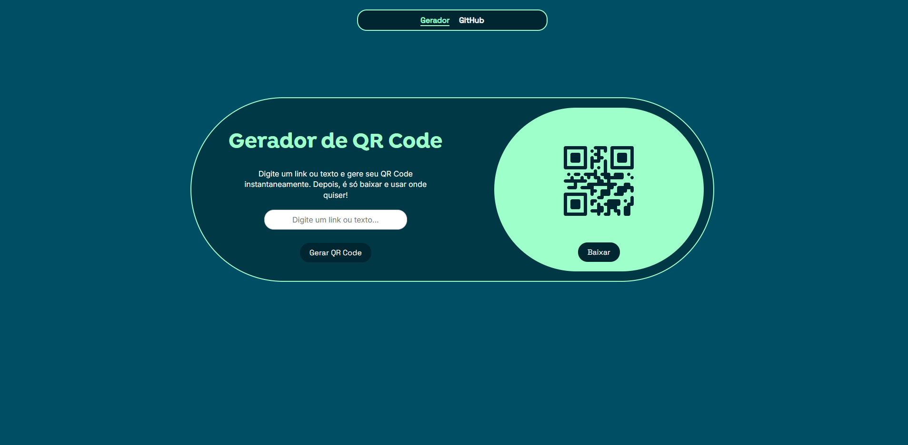

# 🔐 Gerador de QR Code

Projeto simples para gerar QR Codes a partir de texto ou URLs, com opção de baixar o código gerado como imagem. Ideal para uso rápido e fácil, com interface limpa e responsiva.

---

## 🚀 Funcionalidades

- Geração instantânea de QR Code a partir de texto ou link  
- Visualização do QR Code na própria página  
- Download do QR Code em formato de imagem  
- Design responsivo para diferentes tamanhos de tela  
- Navegação simples com menu fixo  

---

## 🎨 Preview do projeto

**Deploy**: visualize [aqui](https://gerador-qrcode-rf.vercel.app)

---

## 🛠️ Tecnologias Usadas

- HTML5  
- CSS3  
- JavaScript  
- Biblioteca: [qr-code-styling](https://github.com/kozakdenys/qr-code-styling)

---

## 📁 Estrutura do Projeto

- `index.html`: estrutura da página  
- `style.css`: estilos visuais  
- `script.js`: lógica de geração e download do QR Code  
- Biblioteca externa `qr-code-styling` importada via CDN

---

## 🔧 Melhorias Futuras

- Opção para personalizar a cor do QR Code  
- Seleção de background personalizado  
- Inserção de logotipo no centro do QR  
- Escolha de formato dos pontos (dots/cantos arredondados)  
- Salvamento de QR Codes gerados anteriormente  

---

Feito com ♡ por **Rafaela T.**

Este projeto foi criado apenas para fins de aprendizado e portfólio.  
Caso queira utilizá-lo ou modificá-lo, entre em contato.
