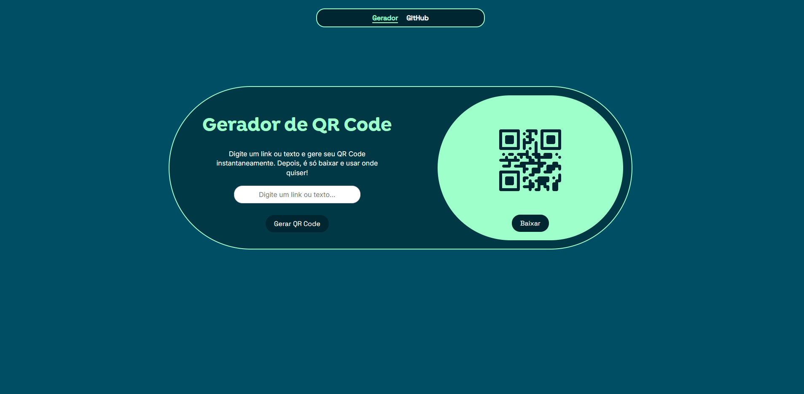

# 🔐 Gerador de QR Code

Projeto simples para gerar QR Codes a partir de texto ou URLs, com opção de baixar o código gerado como imagem. Ideal para uso rápido e fácil, com interface limpa e responsiva.

## 🚀 Funcionalidades

- Geração instantânea de QR Code a partir de texto ou link
-Visualização do QR Code na página
- Download do QR Code em formato de imagem
- Design responsivo para diferentes tamanhos de tela
-Navegação simples com menu fixo

## 🎨 Captura de Tela

## 🛠️ Tecnologias Usadas

- HTML5
- CSS3
- JavaScript

## 🛠 Melhorias Futuras
- Design responsivo para telas pequenas;
- Adicionar animações para uma experiência mais fluida;
- Criar uma versão em React para prática.

#
Feito com ♡ por Rafaela T.

Este projeto foi criado apenas para fins de aprendizado e portfólio. Caso queira utilizá-lo ou modificá-lo, entre em contato.
